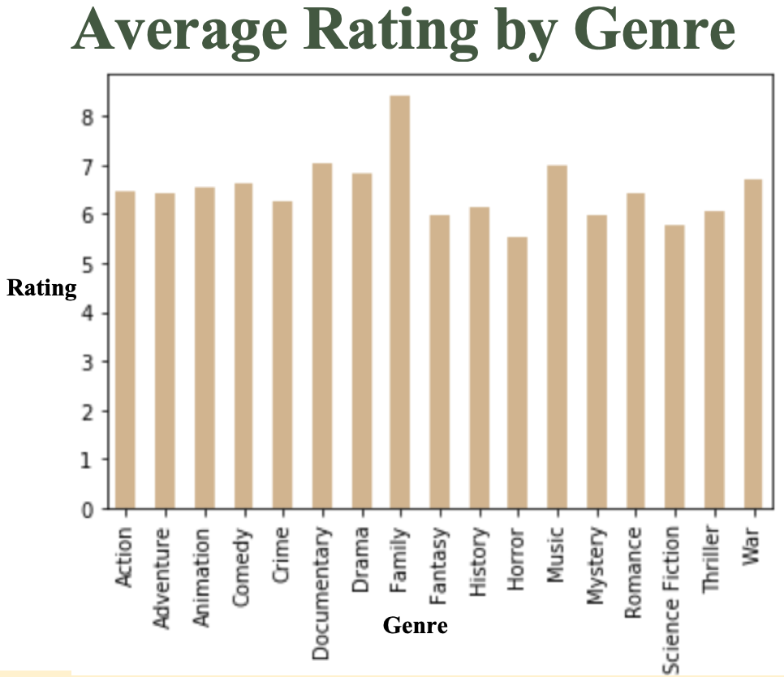
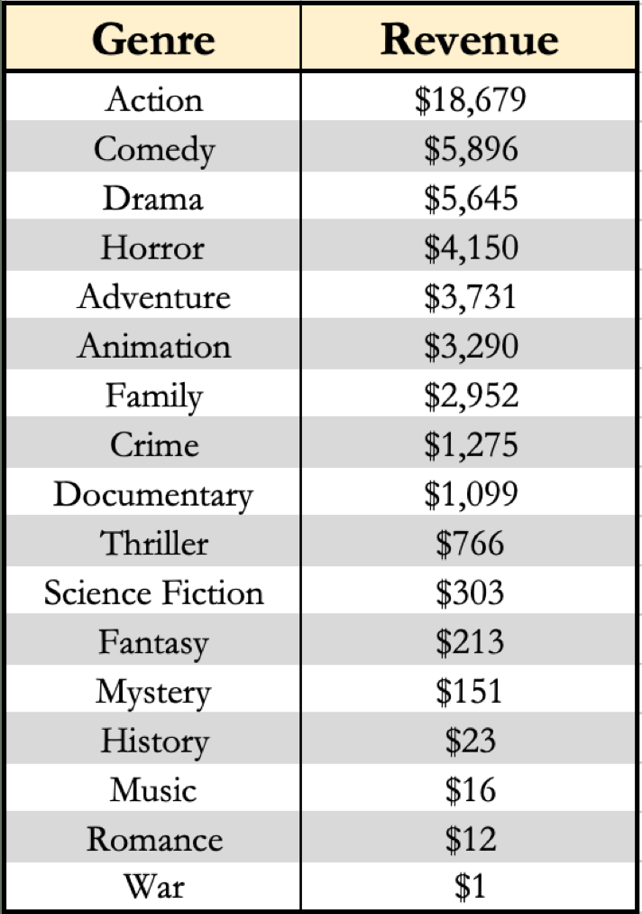
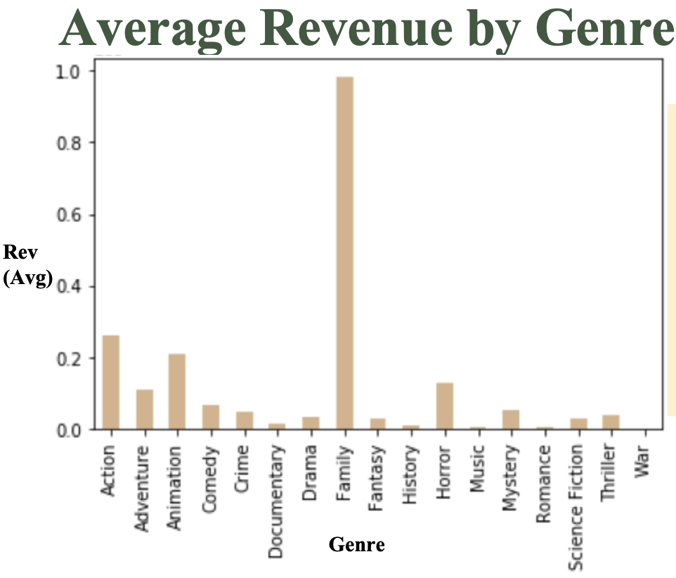
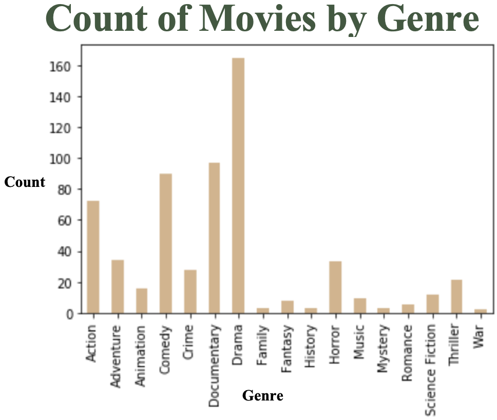

# Movie-Analysis-Project
Analyzing Movies 

## Project Members:

- Ed Haracz
- Chadwick Balloo

## Project Goals:

Explore 2018 movie data by genre and market (foreign vs. domestic) to determine what genre movie to focus production on.

## Tech Stack
- Python
- Pandas
- SQL

## Data 
- The Movie Database (TMDb)
  - All 2018 (release year) movies including genre, rating, rating count, date of release 
- Box Office Mojo
  - Top grossing movies of 2018

## Questions:

- Can we look at 2018 to determine which genres in what markets will perform best?
- What genres produce the most revenue?
- How does foreign vs domestic market affect revenue?
- Can we choose what genre we should produce based on the revenues of 2018 films?

## Findings: 
- Average Rating by Genre:

- Action genre has the largest market

- Family films perform best by movie (Sample size was small however) followed by Action and Animation respectively.

- Drama had the most movies produced followed by Documentary then Comedy.

- There is a very strong correlation between performance Domestically vs. Foreign.
  - Testing a movie domestically would give a very good sense if the movie would be successful abroad.

## Recommendation:

- Action, Animation and Family would be the top three genres we recommend.
- Family produces a very high average revenue per movie and the market is not saturated with a large count of films.
- Action has by far the largest market and revenue per movie is high.
- Animation, like Family, has a lower count of movies and a very solid revenue per movie.
